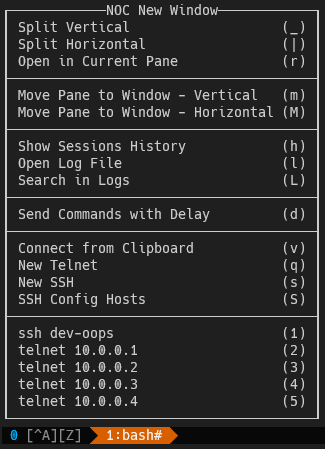

# tmuxNOC <!-- omit in toc -->

tmux config and scripts for people, who have to manage a lot of network devices.

- [Why?](#why)
- [What it does](#what-it-does)
- [Installation](#installation)
- [How it works](#how-it-works)
  - [Project structure](#project-structure)
  - [Sending login/password sequence](#sending-loginpassword-sequence)
  - [Can I use this script with my own .tmux.conf?](#can-i-use-this-script-with-my-own-tmuxconf)
  - [How telnet and SSH connections are made](#how-telnet-and-ssh-connections-are-made)
  - [Clipboard integration](#clipboard-integration)
  - [Sessions history and writing and reading logs](#sessions-history-and-writing-and-reading-logs)
  - [Installing and using tmux on remote host](#installing-and-using-tmux-on-remote-host)

## Why?

I started this project, because everyday I manage a lot of devices, to which I need to connect with telnet or SSH. For the long time I used SecureCRT for this, because it a good solution for this type of purposes. I also like tmux, and wondered if I could bring functionality that I like in SecureCRT to tmux.

For every day use I used [samoshkin](https://github.com/samoshkin)/**[tmux-config](https://github.com/samoshkin/tmux-config)**, it showed me that tmux can be very different from it's default look and settings. Some parts of my config is taken from there, color scheme and overall look is practically a direct copy. Then I dived into [man pages for tmux](https://man.openbsd.org/OpenBSD-current/man1/tmux.1)  and it showed me that you can do practically anything with it.

## What it does

Basically main part of this project is python script. It used to show tmux menus, opening connections for telnet or SSH, writing connections history, writing connected device terminal output in form of logs, automated sending of login/password to the device, sending commands to the device with delay, etc.

After entering `Alt + q` you will see this menu:



- The first section of the menu is for choosing where to open new telnet or SSH session, or any other option from this menu. Like opening log file or viewing session history.
    - Take a note of menu title, it tells where selected option will be opened.
    - By default it will be opened in new tmux window.

- Next section is for moving current tmux pane to other tmux window.

- Section after that is for opening session history file or log file or searching in log files.

- *"Send Commands with Delay"* is script for sending multiple lines to the connected device with line delay or/and character delay. It can be used only from *"NOC New Window"* menu.

- Next section is for opening connection to the device. *"Connect from Clipboard"* is for opening connection to hostname or IP stored in clipboard. *"SSH Config Hosts"* will open new menu that will let you chose from hosts stored in your `.ssh/config` file.

- Next section lists five last hosts that you connected to, so you can reconnect to them quickly.

## Installation 

Just clone the repo into your home directory, because scripts rely on that this project resides in `~/tmuxNOC`. Then run `install.sh`. It will replace your `.tmux.conf`, so make a copy, if you need it.

This config and scripts need:
- tmux 3.1b
- expect
- Python >=3.6

Tmux, expect and other dependencies will be installed by the install script, **but not Python**. It was tested in Debian like distributions and in WSL (Ubuntu 18.04) in Windows 10 with Windows Terminal. Only works with `apt` package manager.

## How it works

This is work in progress project, especially documentation. Later I will add explanation how everything works. For now, in the code itself I tried to make comments and descriptions, some explanation about how everything works you can find there.

Information about key bindings you can find in [KEYS.md](https://github.com/Technik-J/tmuxNOC/blob/master/KEYS.md), but it also yet not finished.

### Project structure

```
|-- local/                // This directory is automatically generated
    |-- log/                    // Contains terminal logs from connected hosts
    |-- .logins                 // User credentials for automated login
    |-- sessions.json           // Sessions metadata
    |-- sessions_history.log    // History of connected hosts
|-- misc/
    |-- paste.cs                // Getting clipboard content from Windows, needs to be compiled
    |-- tmux_noc_bashrc         // .bashrc that used for connections
|-- scripts/
    |-- kbdfix.sh               // Fixes backspace and delete key on VT100 terminal
    |-- paste.sh                // Getting the content of clipboard
    |-- yank.sh                 // Setting the content of clipboard
    |-- tmux_noc.py             // Main Python script
|-- install.sh                  // Installation script
|-- tmux.conf                   // tmux config
|-- tmux.remote.conf            // tmux config that will be used on remote hosts
|-- remote_install_playbook.yml // Ansible playbook for installing tmux and needed files to remote host
|-- KEYS.md                     // Describes key bindings
|-- README.md                   // This file
```

### Sending login/password sequence

You can send predetermined login/password sequence to the terminal. For that you need to have file `.logins` in `~/tmuxNOC/local` directory with this stricture:

```
LOGIN1=user1
PASS1=password1
LOGIN2=user2
PASS2=password2
```

You can have multiple logins in this file. To send them to the terminal use `Alt + login_number`. For example `Alt + 1` key binding to send `LOGIN1` and `PASS1` and so on. 

This lines in `tmux.conf` are setting key bindings:

```
bind -n M-1 run -b "~/tmuxNOC/scripts/tmux_noc.py login --login_number 1"
bind -n M-2 run -b "~/tmuxNOC/scripts/tmux_noc.py login --login_number 2"
```

As you can see, there are only two keys configured, but you can add more, if you need.

Of course you **should not** store login credentials in plain text at systems that you do not trust and not only you have root rights. I even say, that you should not store login credential in plain text anywhere, but I still thinking how to store it securely and for script to access it. For now set read write permission only for your user for this file, so it will stay only between you and root.

### Can I use this script with my own .tmux.conf?

Yes. Find `tmuxNOC` section in `tmux.conf`, there you find all the configuration for tmux that uses main `scripts/tmux_noc.py` script. You can copy it to your own config.

### How telnet and SSH connections are made

After you chose too connect to *New telnet* or *New SSH* you will be prompted to enter hostname. Everything you type there will be used as an arguments to the `telnet` and `ssh` commands on your system, so you can use any arguments you like.

New tmux pane will be created that will run bash with custom rcfile `misc/tmux_noc_bashrc` and environment variable `PROMPT_COMMAND` set to *ssh* or *telnet*. So after you disconnected from the host, you can hit Enter to reconnect.

For *telnet* some extra steps will be taken. The `TERM` will be set to `vt100-w` and *telnet* command will be run through `scripts/kbdfix.sh` that uses `expect` to fix backspace and delete keys. The reason why you can find [here](http://www.afterstep.org/keyboard.html).

### Clipboard integration

`scripts/yank.sh` and `scripts/paste.sh` are responsible for integration with system clipboard.

`yank.sh` pretty much a copy from [here](https://github.com/samoshkin/tmux-config/blob/master/tmux/yank.sh). It used for setting clipboard content when you select text in tmux.

`paste.sh` is used to set tmux buffer with the content from system clipboard. It used for pasting with right mouse button, and for connecting to host from clipboard. For Windows you need to compile `misc/paste.cs`, the instructions of how to are in this file.

More information about clipboard integration with tmux you can find in [tmux wiki](https://github.com/tmux/tmux/wiki/Clipboard).

### Sessions history and writing and reading logs

When you connect to the host, information about when and to which host is stored in `local/sessions_history.log`. You can open it with *Show Sessions History* from tmuxNOC menu. It writhen in this format:

```
# 13.07.2020 // The connections from the same date are grouped
    // connection_number date time connection_type hostname
    220 13.07.2020 11:34:08 ssh example.com
    221 13.07.2020 15:45:30 telnet 10.0.0.1
```

Each connection created from tmuxNOC menu is logged. Terminal log is stored in separate files. The log file naming look like this `local/log/{year}/{month}/{hour}_{minute}_{second}---!{connection_number}_{short_connection_type}_{hostname}.log`.

You can view log file by selecting *Open Log File* from tmuxNOC menu and entering connection number.

To search in logs you can use *Search in Logs* from tmuxNOC menu. It will open new pane, where you can enter a search query.

### Installing and using tmux on remote host

You can use Ansible playbook `remote_install_playbook.yml` to install tmux and needed config files to the remote host. You will need sudo rights and playbook only has *apt* package manager support. For quick reference, this is how you can do it for one host:

```
ansible-playbook -K -u user_on_the_remote -i hostname, remote_install_playbook.yml
# It then will ask for sudo password on the remote host
```

For remote connection tmux uses addition config `tmux.remote.conf`. It sets status bar on top and changes it colors. Also **changes prefix** key to `Alt + a`. This config will be used every time that you connect via ssh, to not use it, set `tmux_do_not_use_remote_config` environment variable to `true`.
